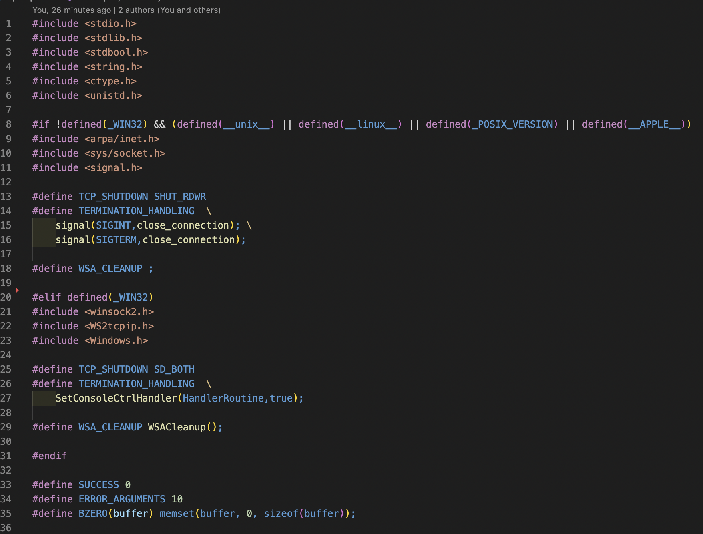
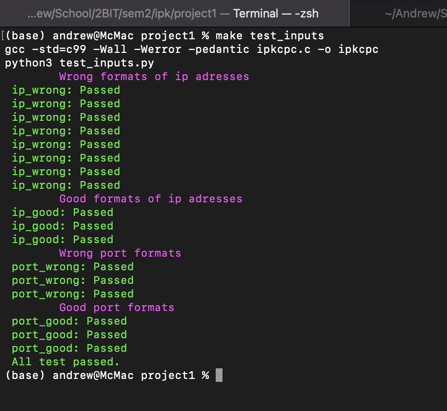

## Dokumentácia pre klienta pre remote kalkulačku

#### Autor: Adrián Ponechal

#### Login: xponec01

## Obsah

- Teória nutná k pochopeniu projektu
- Funkčné časti kódu
- Testovanie programu
- Zdroje

## Teória

### TCP

Vytvára spojenie medzi práve dvomi stranami. Cez spojenie je možné príjmať aj posielať správy.

#### Nadviazanie spojenia

Zjednodušene: každá z komuničkných strán si vytvorí nádnodné poradové čislo, od ktorého bude číslovať bity. Úplne prvý datagram, ktorý posiela strana ma nastavený príznak SYN. Ak je nastavený príznak ACK, tak je v packete prítomný aj potvrdzovacie číslo . Vykoná sa v troch krokoch (three-way handshake)[[1]](#1):

1. klient odošle datagram s nastaveným príznakom SYN a náhodne vygenerovaným poradovým číslom x (potvrdzovacie číslo = 0)
2. server odošle datagram s nastavenými príznakmi SYN a ACK, s potvdrzovacím číslom=x + 1 a náhodne vygenerováným poradovým číslom y
3. klient odošle datagram s nastaveným príznakom ACK s poradovým číslom=x+1 a číslom odpovede=y+1

### UDP

Tento protokol je jednoduché rozhranie medzi sieťovovou a aplikačnou vrstvou. Nezaračuje doručenie správy a neudržuje stav (spojenie) už odoslaných správ. Na prenos packetov využíva hlavičku, v ktorej sa nachádzajú metadata.[[2]](#2) V našom prípade bola hlavičká tvorená 8 bitov dlhým operačným kódom (v prípade req `opcode = 0`, v prípade odpovede `opcode = 1`), dĺžko správy reprezentovanú 8 bitmi a obsahom samotnej správy.

## Program

Client `ipkcpc` načíta zo štandartného vstupu `stdin` správy pre daný server, ku ktorému sa pripojí podľa zadaných parametrov. V prípade akejkoľvek chyby vráti nenulovú návratovú hodnotu a chybu vypíše na štandartný chybový výstup `stderr`.

Má 3 havné časti:

1. funkcia `main`
2. funkcia `udp_connection`
3. funnkcia `tcp_connection`

Vo funkcii `main` prebiehajú hlavne kontroly vstupných parametrov. Pri zadaní zlých parametrov vráti chybový kód `10` a na `stderr` vypíše použitie. Pre vypísanie samotného použitia je možné zavolať program v tvare `ipkcpc -h`. Po úspešnom načítaní voláme funkciu pre spojenie podľa hodnoty parametru `-m <mode>`, ktorá sa uloží do globálne premennej `connection_t mode`. Typ `connection_t` je výčtový typ pre hodnotu spojenia (bol vytvorený z dôvodu rýchlejšieho porovnávnia v kóde).

Ak má premenná `mode` hodnotu `udp`, tak sa spustí funkcia `udp_connection`, ktorá zabezpečí spojenie podľa protokolu udp. Spomenie v tejto funkcii môže byť prerušené len poslaním signálu `Ctrl + c`.

V prípade, kde je `mode` nastavené na hodnotu `tcp` sa spustí funkcia `tcp_connection`. Táto funkcia vytvorí spojenie podľa TCP, v inom prípade vrádi návratovú hodnotu `1`. K ukončeniu programu dochádza, ak dostane na štandartný vstup `BYE` alebo príde odpoveď od serveru `BYE`. Prípadne sa korektne ukončí aj pri poslaní signálu `Ctrl + c`.

Funkcie sa líšia hlavne v oblastiach vyplývajúcich z teórie (funkcie `send()` a `sendto()`.`recv()` a `recvfrom()`). Program je kompatibilný ako so systémami Linux a MacOS, tak aj na Windows (aplikácie typu \_WIN32)

## Testovanie

Testovanie programu prebiehalo dvomi spôsobmi:

### 1. automatické testy

Tento typ testovania bol využitý najmä pre testy kontroly správnosti príjmaných parametrov. Na teno účel bol vytvorený script `test_inputs.py`. Pri testovaní scriptu musí byť server vypnutý (najmä localhost). Pre spustenie scriptu je treba mať nainštalovaný python3.

### 2. Testy funkčnosti v referenčnom prostredí

Testy boli vykonané v referenčnom protredí. Testované boli hlavne prípady ukončenia programu, ale aj funkčosť výstupu.

# SEM OBRAZKY

## Zdroje

- <a id="1">[1]</a> Transmission Control Protocol \[online\], posledná aktualizácia 11. 11. 2022 v 06:42, https://cs.wikipedia.org/wiki/Transmission_Control_Protocol
- <a id="2">[2]</a>User Datagram Protocol \[onlie\], posledná aktualizácia 24. 8. 2021 v 00:16, https://cs.wikipedia.org/wiki/User_Datagram_Protocol
